> ℹ️ **Conservée avec adaptations V2 (2026-07-04).** Diagrammes acquisition valides ; diagrammes synthèse/export obsolètes.
> Voir `docs/specs/v2/00-fondations-v2.md` et `docs/specs/v2/01-protocole-mcp.md`.

# 11 — Diagrammes de séquence

> Référence visuelle pour comprendre les flux principaux de l'application.
> Les diagrammes utilisent Mermaid (rendu par GitHub, GitLab, VS Code, et
> la plupart des viewers Markdown modernes).

## Sommaire

| Diagramme | Domaine | Sprint |
|-----------|---------|--------|
| 1. Création projet et ajout sources | Projets | 2 |
| 2. Découverte d'une chaîne et sélection | Scraping | 2 |
| 3. Pipeline événementiel scraping → transcription | Scraping/Transcription | 2-3 |
| 4. Indexation pgvector et disponibilité corpus | Corpus | 4 |
| 5. Pipeline de synthèse (Mistral via ag.flow) | Synthèse | 5 |
| 6. Génération identity et export ag.flow | Synthèse/Export | 5-7 |
| 7. Régénération ciblée d'un document | Synthèse | 5 |
| 8. Provisioning de workers user | Transcription | 3 |
| 9. Auto-stop d'un worker idle | Transcription | 3 |
| 10. Bascule sur épuisement de crédit | Transcription | 3 |
| 11. Connexion GitHub OAuth | Publication | 8 |
| 12. Publication d'un rôle sur GitHub | Publication | 8 |

---

## 1. Création d'un projet et ajout de sources

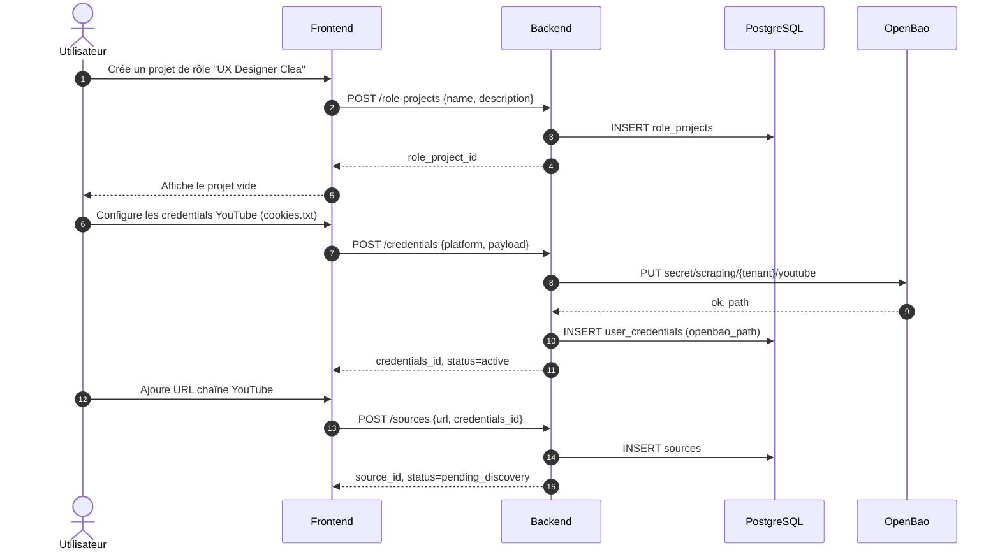

## 2. Découverte d'une chaîne et sélection

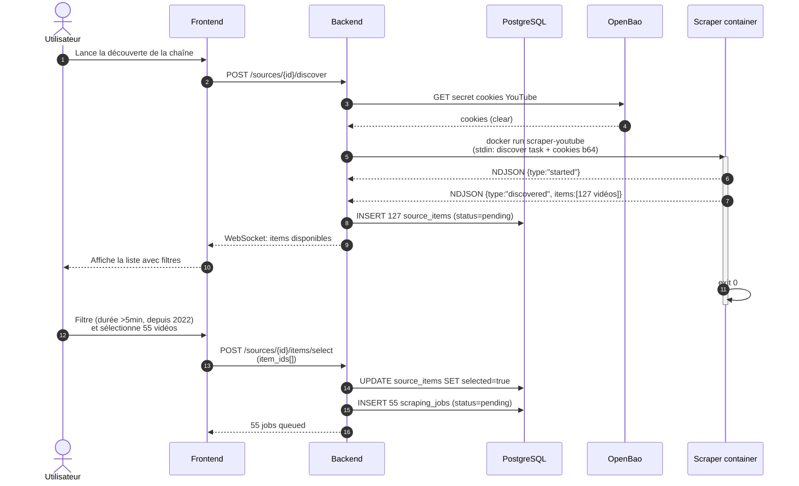

## 3. Pipeline événementiel scraping → transcription

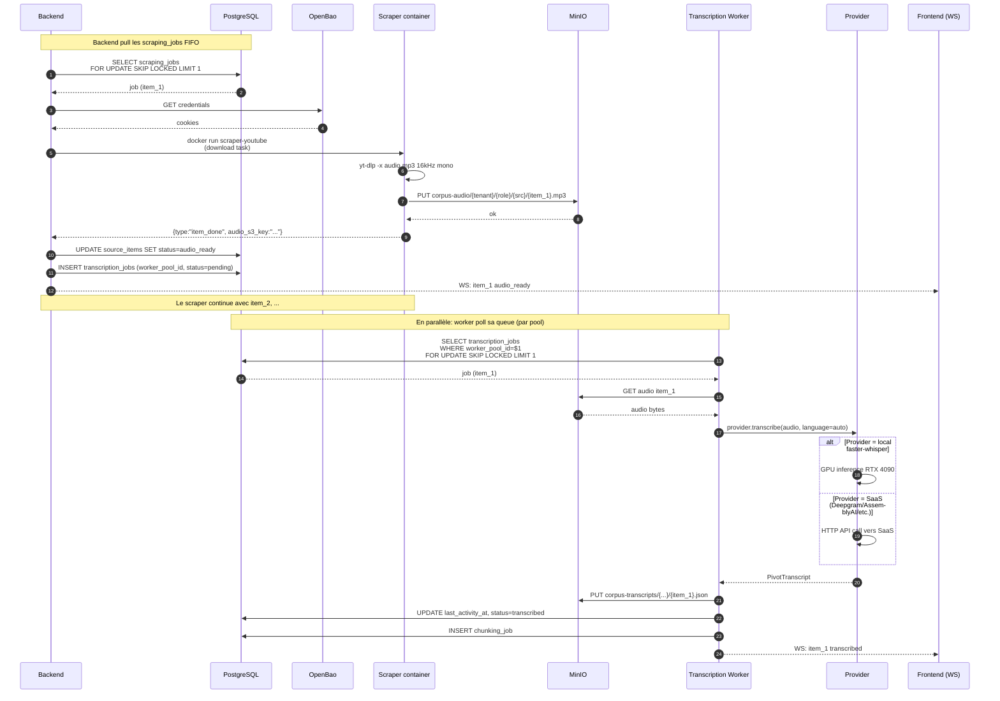

## 4. Indexation pgvector et disponibilité corpus

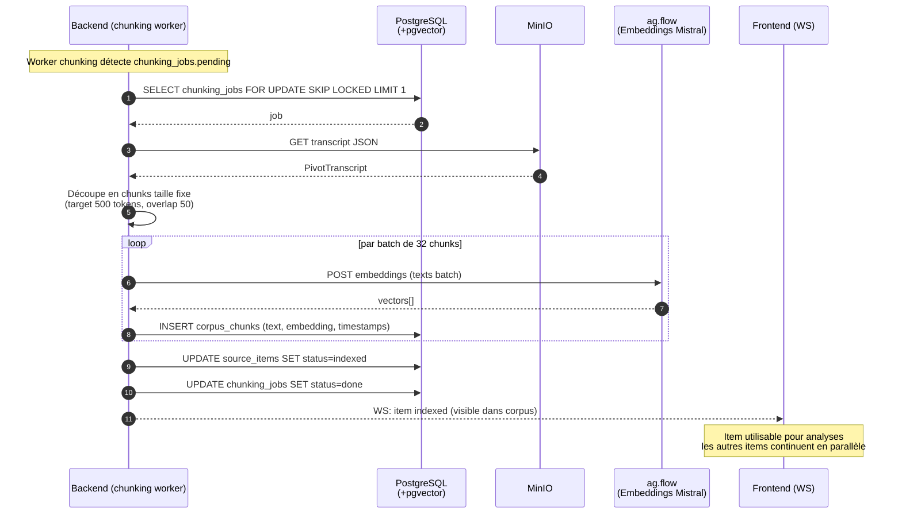

## 5. Pipeline de synthèse (Mistral via ag.flow)

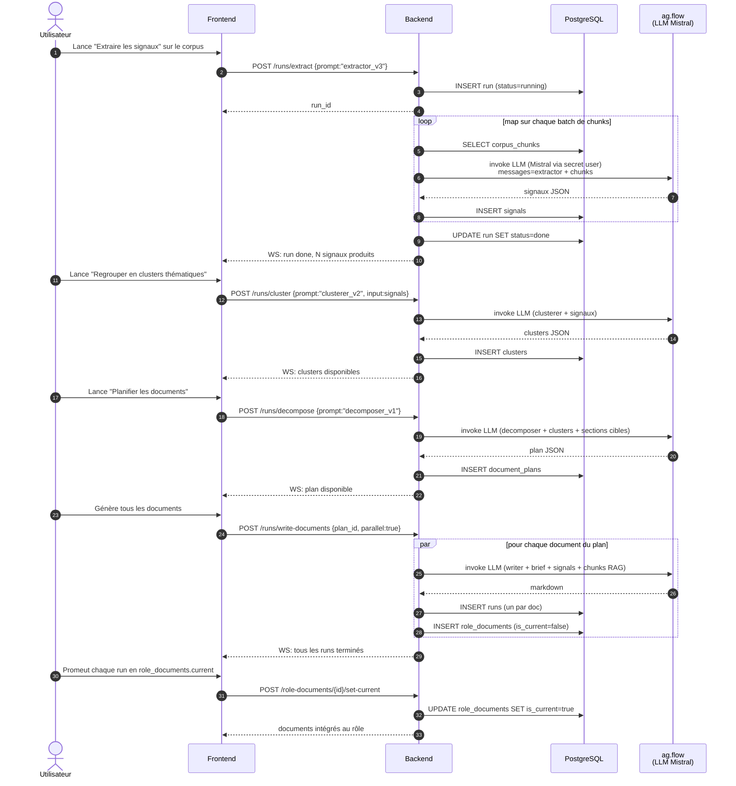

## 6. Génération de l'identity et export vers ag.flow

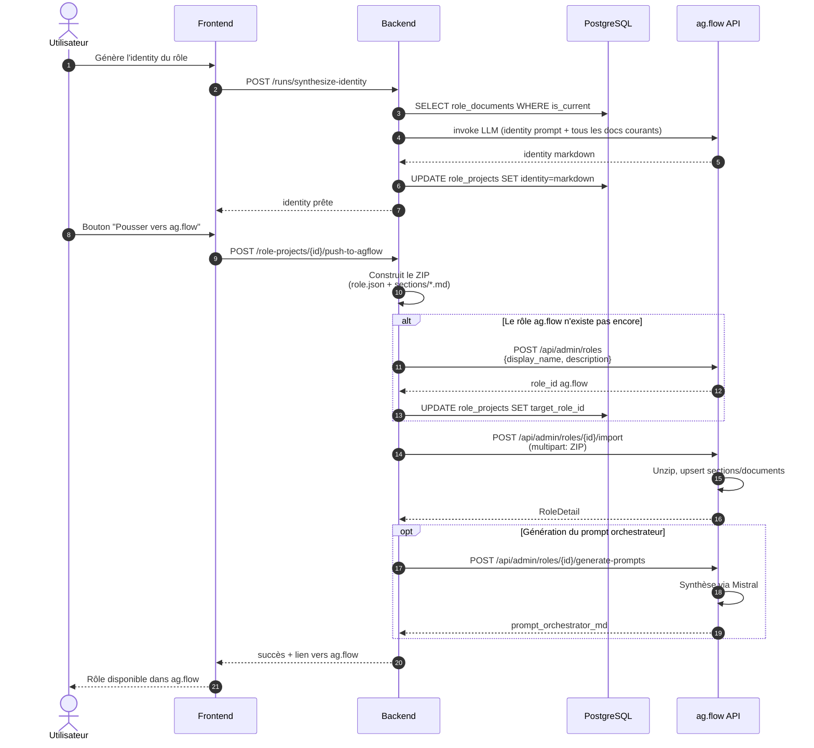

## 7. Régénération ciblée d'un seul document

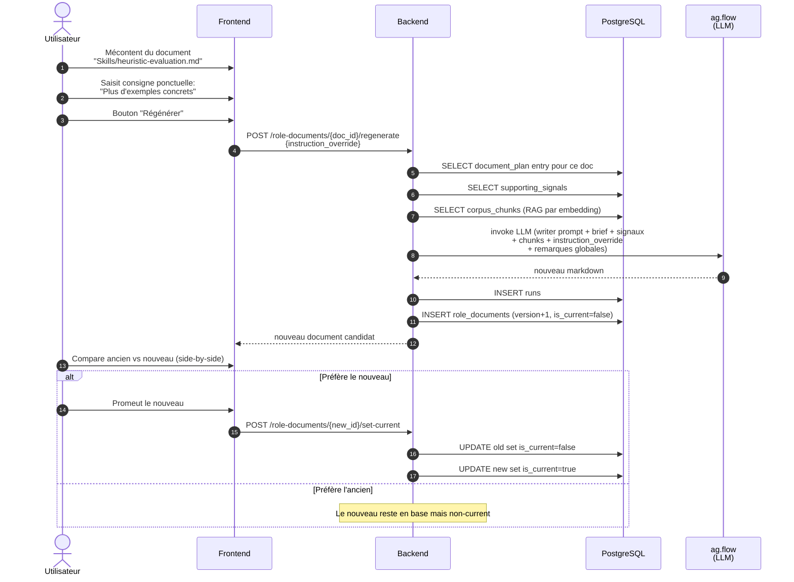

## 8. Provisioning de workers user à partir d'une clé SaaS

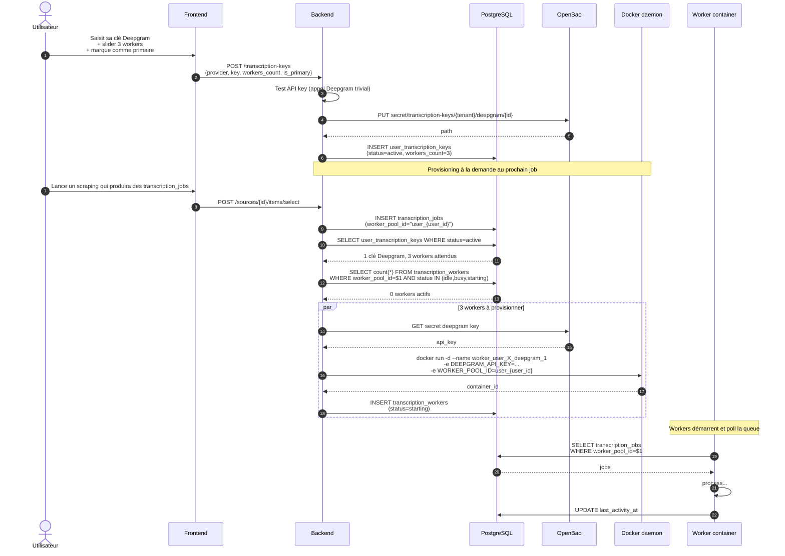

## 9. Auto-stop d'un worker user après 5 minutes d'inactivité

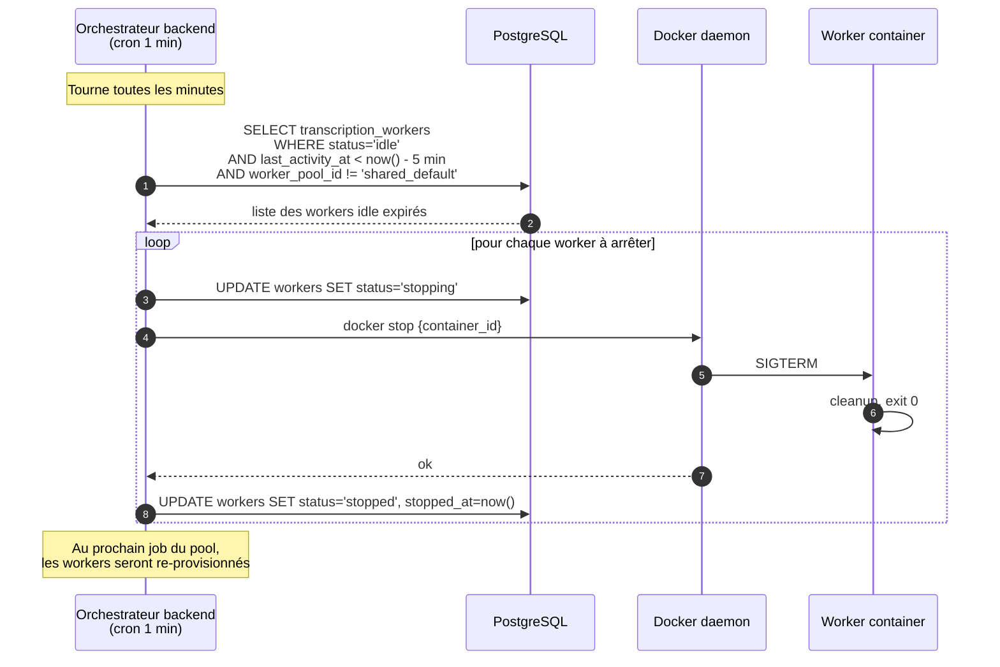

## 10. Bascule sur épuisement de crédit

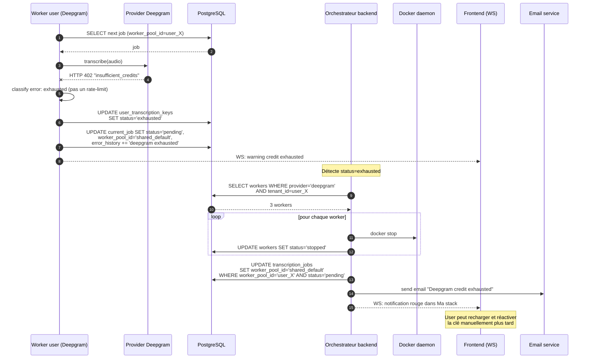

## 11. Connexion GitHub via OAuth

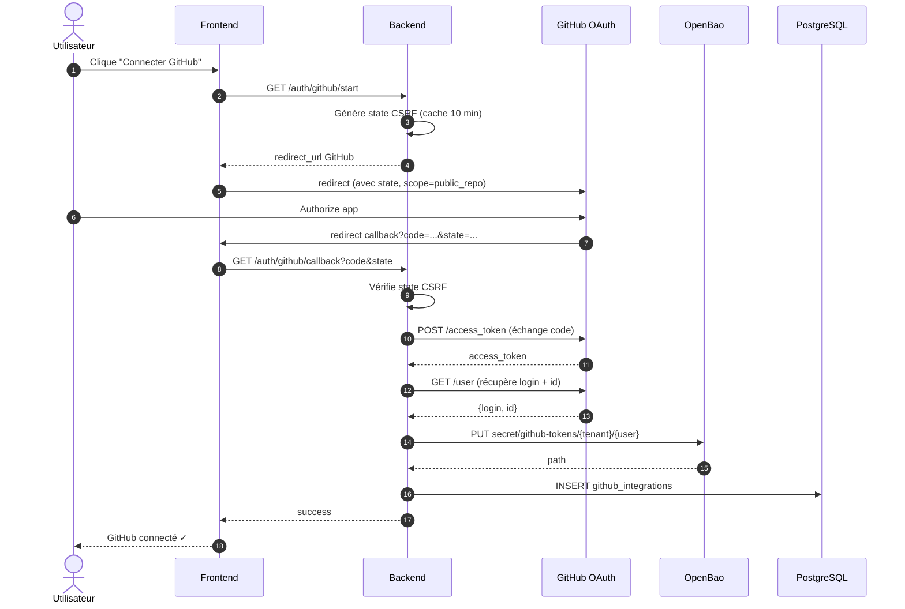

## 12. Publication d'un rôle sur GitHub

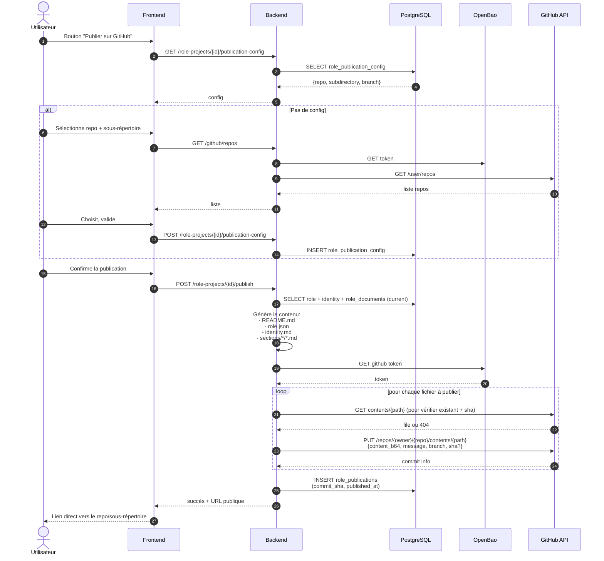

---

**Document précédent :** `10-frontend-ux.md`
**Document suivant :** `12-open-decisions.md`
